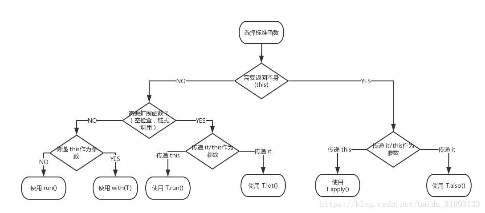

学习《Kotlin从入门到项目实战》徐鸿福

---
## 内联扩展函数 let, also, with, run, apply
文件 Standard.kt
inline expansion function

在计算机科学中，内联函数（有时称作在线函数或编译时期展开函数）是一种编程语言结构，用来建议编译器对一些特殊函数进行内联扩展（有时称作在线扩展）；也就是说建议编译器将指定的函数体插入并取代每一处调用该函数的地方（上下文），从而节省了每次调用函数带来的额外时间开支。但在选择使用内联函数时，必须在程序占用空间和程序执行效率之间进行权衡，因为过多的比较复杂的函数进行内联扩展将带来很大的存储资源开支。另外还需要特别注意的是对递归函数的内联扩展可能引起部分编译器的无穷编译。

* let
let 扩展函数的实际上是一个作用域函数，当你需要去定义一个变量在一个特定的作用域范围内，let函数的是一个不错的选择；
let 函数另一个作用就是可以避免写一些判断null的操作。
let是以闭包的形式返回，返回函数体内最后一行的值，如果最后一行为空就返回一个Unit类型的默认值。

* also
also 函数的结构实际上和 let 很像唯一的区别就是返回值的不一样，also函数返回的则是传入对象的本身

* with
适用于调用同一个类的多个方法时，可以省去类名重复，直接调用类的方法即可，返回值为最后一行的值或者指定的 return 的表达式。

* run
run 函数实际上可以说是 let 和 with 两个函数的结合体，run 函数只接收一个 lambda 函数为参数，以闭包形式返回，返回值为最后一行的值或者指定的 return 的表达式。

* apply
从结构上来看apply函数和run函数很像，唯一不同点就是它们各自返回的值不一样，run函数是以闭包形式返回最后一行代码的值，而apply函数的返回的是传入对象的本身。
apply 适用于创建构造者模式
apply 还可以用于连续判断为空的逻辑

## kotlin中xml中控件id如何命名

## 参考资料
* [内联扩展 inline expansion An Inline Function is As Fast As a Macro 与宏的比较](https://www.cnblogs.com/yuanjiangw/p/10505504.html)

* 

